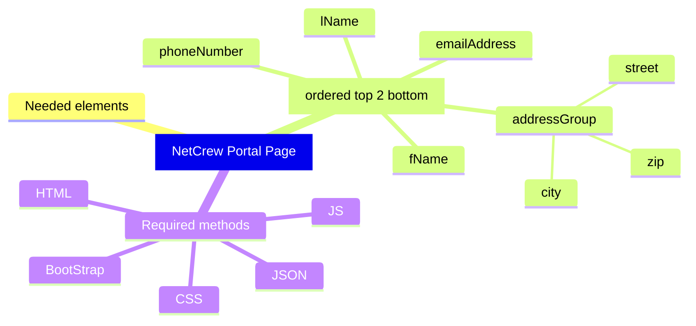
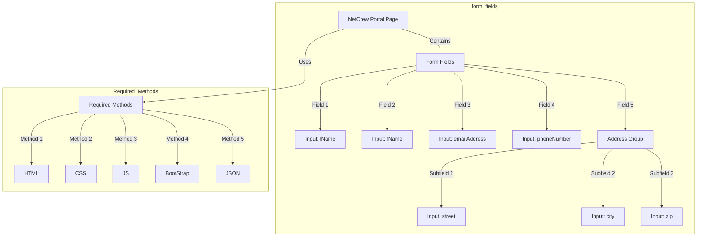
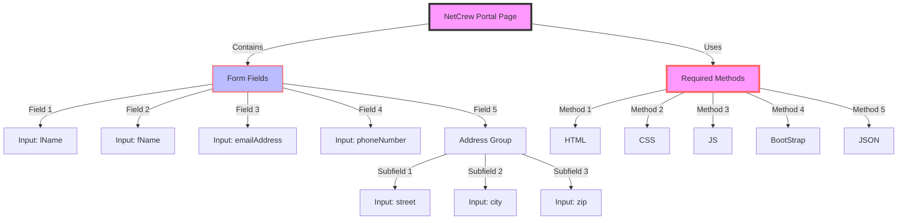
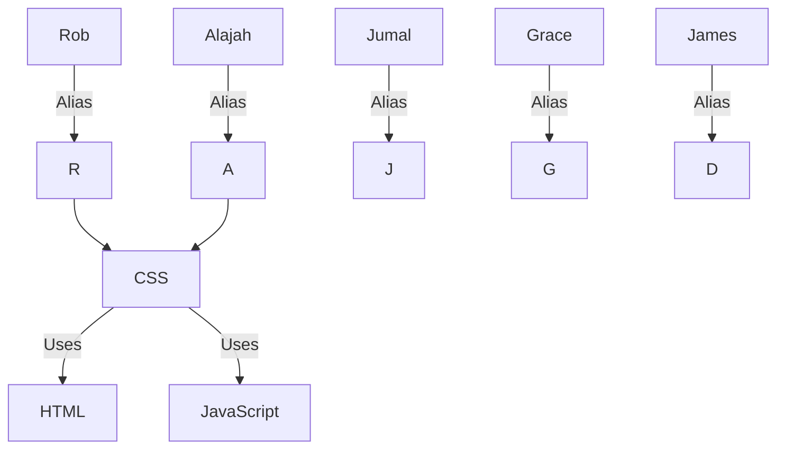
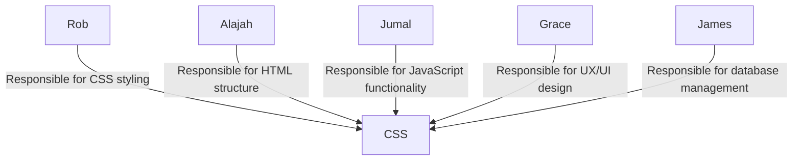

# NetCrew Shopping

### Group Members:
    - Rob Geist
    - James Do
    - Alajah Rivera
    - Jumal Barker
    - Grace Kang
  

```mermaid
mindmap
  [NetCrew Portal Page]
    Needed elements 
    [ordered top 2 bottom]
      lName
      fName
      emailAddress
      phoneNumber
      addressGroup
        street
        city
        zip
    Required methods
      HTML
      CSS
      JS
      BootStrap
      JSON
```

```mermaid
graph TD;
    subgraph form_fields
    A[NetCrew Portal Page] ---|Contains| B[Form Fields];
    
    B --->|Field 1| C[Input: lName];
    B --->|Field 2| D[Input: fName];
    B --->|Field 3| E[Input: emailAddress];
    B --->|Field 4| F[Input: phoneNumber];
    B --->|Field 5| G[Address Group];
    G --->|Subfield 1| H[Input: street];
    G --->|Subfield 2| I[Input: city];
    G --->|Subfield 3| J[Input: zip];
    end
    subgraph Required_Methods
    A --->|Uses| K[Required Methods];
    K --->|Method 1| L[HTML];
    K --->|Method 2| M[CSS];
    K --->|Method 3| N[JS];
    K --->|Method 4| O[BootStrap];
    K --->|Method 5| P[JSON];
    end
```

```mermaid
graph TB;
    A[NetCrew Portal Page] -->|Contains| B[Form Fields];
    B -->|Field 1| C[Input: lName];
    B -->|Field 2| D[Input: fName];
    B -->|Field 3| E[Input: emailAddress];
    B -->|Field 4| F[Input: phoneNumber];
    B -->|Field 5| G[Address Group];
    G -->|Subfield 1| H[Input: street];
    G -->|Subfield 2| I[Input: city];
    G -->|Subfield 3| J[Input: zip];
    A -->|Uses| K[Required Methods];
    K -->|Method 1| L[HTML];
    K -->|Method 2| M[CSS];
    K -->|Method 3| N[JS];
    K -->|Method 4| O[BootStrap];
    K -->|Method 5| P[JSON];
    
    %% Add items extending to the side of particular nodes
    style A fill:#f9f,stroke:#333,stroke-width:4px;
    style B fill:#bbf,stroke:#f66,stroke-width:2px;
    style K fill:#f9f,stroke:#f66,stroke-width:4px;
```

```mermaid
graph TD;
    Rob["Rob"] -->|Alias| R["R"];
    Alajah["Alajah"] -->|Alias| A["A"];
    Jumal["Jumal"] -->|Alias| J["J"];
    Grace["Grace"] -->|Alias| G["G"];
    James["James"] -->|Alias| D["D"];

    CSS["CSS"] -->|Uses| HTML["HTML"];
    CSS -->|Uses| JavaScript["JavaScript"];

    R --> CSS;
    A --> CSS;
```

```mermaid
graph TB;
    R["Rob"] -->|Responsible for CSS styling| C["CSS"];
    A["Alajah"] -->|Responsible for HTML structure| C;
    J["Jumal"] -->|Responsible for JavaScript functionality| C;
    G["Grace"] -->|Responsible for UX/UI design| C;
    D["James"] -->|Responsible for database management| C;


```